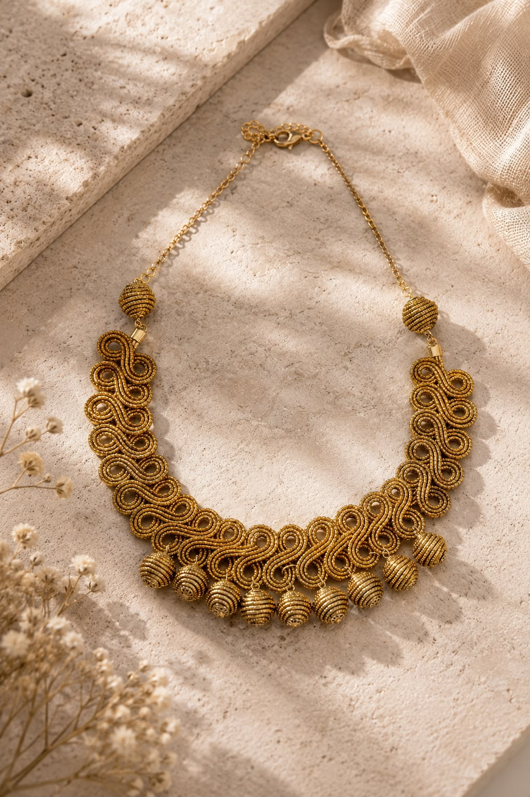

# Moikato — biojoias brasileiras



Site institucional e catálogo digital bilíngue para uma marca de biojoias
artesanais feitas com capim-dourado do Jalapão.

[Acessar o site](https://moikato.com) ·
[Explorar o design system](https://moikato.com/pt-BR/design-system)

## O projeto

A experiência conecta produto, origem e impacto social por meio de uma narrativa
visual editorial. O conteúdo apresenta o processo artesanal, a comunidade e o
catálogo sem perder desempenho, acessibilidade ou encontrabilidade em buscadores.

## Destaques

- Experiência completa em português e inglês, com rotas localizadas.
- Preferência de idioma persistida e redirecionamento por locale.
- Catálogo de produtos com dados estruturados `Product` e `ItemList`.
- SEO técnico com sitemap, robots, canonical, alternates e Open Graph.
- Design system próprio disponível em uma rota navegável.
- Imagens de contexto com créditos e licenças documentados.
- Analytics e métricas de desempenho da Vercel.
- Layout responsivo com animações progressivas e respeito à identidade da marca.

## Tecnologias

- Next.js
- React
- Tailwind CSS
- JavaScript
- Vercel Analytics e Speed Insights
- ESLint

## Estrutura

```text
src/
├── app/[lang]/       # rotas, metadados e conteúdo localizado
├── components/       # seções e elementos da interface
├── dictionaries/     # textos em português e inglês
└── lib/              # configuração do site e contato
```

## Como executar

```bash
npm install
npm run dev
```

A aplicação estará disponível em `http://localhost:3000`.

## Verificação

```bash
npm run lint
npm run build
```

## Configuração

O domínio padrão é `https://moikato.com`. Para usar outro endereço, defina
`NEXT_PUBLIC_SITE_URL` no ambiente de execução.

---

Desenvolvido por [João Pombo](https://github.com/JoOoJP).
